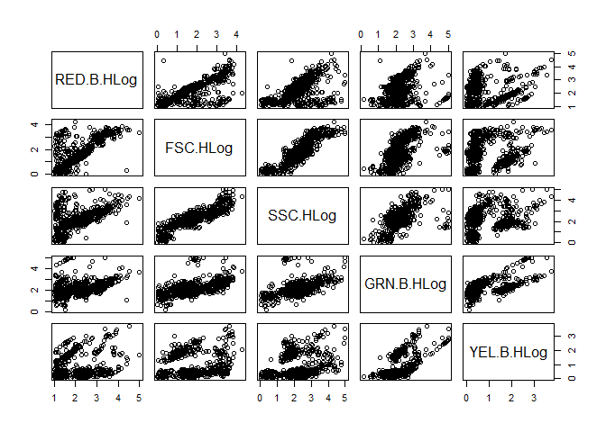
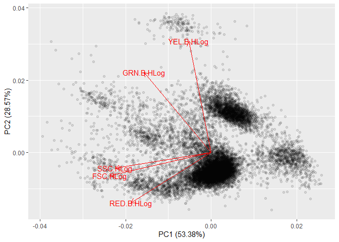
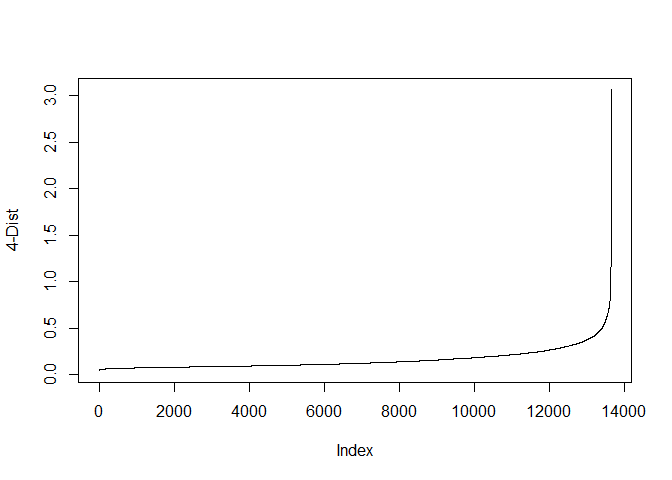
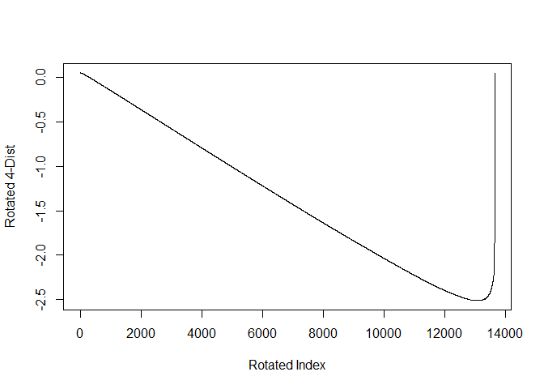
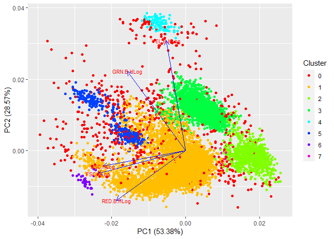
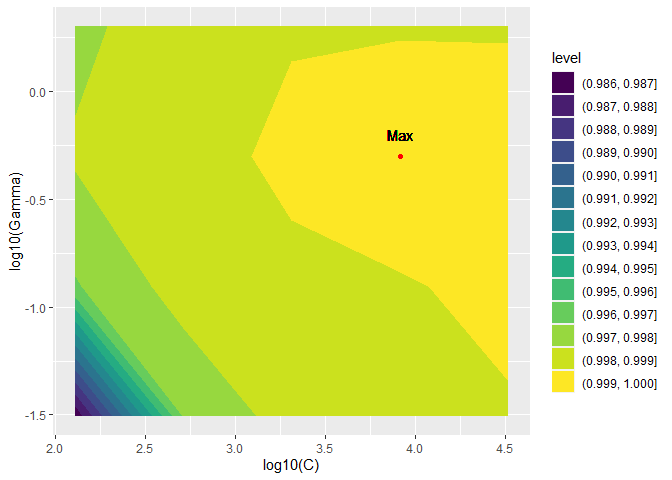
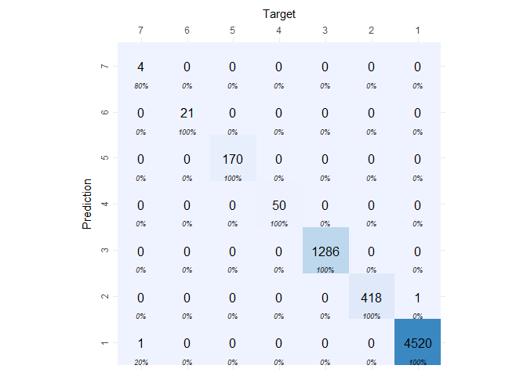
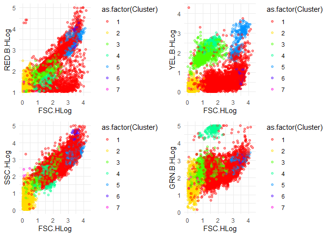

#Flow Cytometry Data Woes

Flow cytometers (FC), are versatile laboratory instruments used to analyze everything from blood samples to marine plankton communities. In essence, particles suspended in liquid pass through the instrument's laser, and the instrument measures light scattering and autofluorescent properties of each particle. Not surprisingly, these instruments were not designed to process marine water (my usage), and so I face challenges that don't arise in many other laboratory settings. For one, the marine plankton communities are enormously diverse, with dozens of unique taxa observable in even microliters of water.

In terms of data, the major issues include, the fact that we do not know how many clusters should exist beforehand (how many different plankton are in the water?), further, is the obstacle of how to efficiently process large volumes of data: 3,800,000  observations per file (1 sample) multiplied by dozens to hundreds of files. This prioritizes, not only an accurate analysis method, but an efficient one. 
In this page, I will show how I addressed this problem for the flow cytometery data I work with, however, it should be apparent, that the core of this method is one that should be versatile for different instruments and samples.

#Data Structure Summary

Our data come from a Guava EasyCyte HT® (EMD Millipore, Darmstadt Germany) uses a blue laser (488 nm) to measure two trait classes for each particle: fluorescence and scatter. Red (695/50 nm), Yellow (583/26 nm), and Green (525/30 nm) fluorescence are all recorded, providing the capacity to decipher unique combinations and densities of pigment, in both unaltered and stained samples. Forward and side scatter evidence size and textural characteristics respectively. Standard practice in our laboratory is to measure the maximum number of particles per sample (200,000). 

All parameters are meaured for each particle, so there is no missing data. Because of the wide scales of particles processed, I will be showing and working with the $Log_{10}$ transformed data.


```
## Warning: package 'dplyr' was built under R version 3.6.3
```

```
## 
## Attaching package: 'dplyr'
```

```
## The following objects are masked from 'package:stats':
## 
##     filter, lag
```

```
## The following objects are masked from 'package:base':
## 
##     intersect, setdiff, setequal, union
```

```
## Warning: package 'GGally' was built under R version 3.6.3
```

```
## Loading required package: ggplot2
```

```
## Warning: package 'ggplot2' was built under R version 3.6.3
```

```
## Registered S3 method overwritten by 'GGally':
##   method from   
##   +.gg   ggplot2
```

<!-- -->

#Workflow

The proceeding analysis expanded upon in later sections will follow the proceeding strategy:
  1.) Group data by sample type
  2.) For each group, subsample data from all the files in each of these groups
  3.) For each group, train and optimize DBSCAN clustering and SVM classifiers on the data subset
  4.) For each file, classify all data in the file
  5.) Extract and store
  6.) Plot and store each classified dataset for expert validation
  
#Subsampling

To cluster, we do not need to work with all the data (this would be very computationally expensive!), however we want to make sure that files that should have clusters in common (though not necessarily all), will identify consistently across files. To ensure that clustering will be consistent across files, we subsample observations from all the common files, and train the classifier on these common files. In other words, if we have 10 files that should have at least some consistent clusters we want to compare, pull some data, from each of these files and pool it together. How large our subsamples are might be decided by how much data we want to work with for training, with tradeoffs of showing enough examples of each cluster, and computational speed. In this case, I will use 1000 samples from each file, which gets us sufficient samples from the data clusters. We can do this easily with a sampling function


```r
library(ggfortify)
```

```
## Warning: package 'ggfortify' was built under R version 3.6.3
```

```r
library(cluster)
```

```
## Warning: package 'cluster' was built under R version 3.6.3
```

```r
PCA.dat=prcomp(D,scale. = TRUE)
autoplot(PCA.dat,loadings=TRUE,loadings.label=TRUE, label.size=3,alpha=0.1)
```

<!-- -->

#Clustering and training with DBSCAN

Now, with our representative sample, we want to figure out roughly where and how many clusters are in the data. This is where we will use density-based spatial clustering of applications with noise (DBSCAN, Ester et al. 1996). As the name suggests, the algorithm is based on finding high density regions of data. It is advantageous in several regards including that clusters are not restricted to linear associations or shapes. To briefly describe: 

The algorith iteratively works to find core points in high density regions and outliers in low density regions. We need two hyperparameters for this algorithm. The first is $minPts$, which is the minimum number of points within distance $\epsilon$ (our second parameter), for a point to be defined as a core point. Points within distance $\epsilon$ of a core point are considered directly reachable, and reachable if there are points connecting the two within distance $\epsilon$ of eachother. Points that aren't reachable are our outliers. This is important to understand because it informs how and why changing $minPts$ and $\epsilon$ will change the outcome of the clustering. Clusters are identified as having all points mutually reachable. If a high density point is reachable from the core points of the cluster, it is part of the cluster as well. 

Obviously, it is necessary we come up with some decision making for $minPts$ and $\epsilon$. 

For $\epsilon$ we will follow the idea suggested in (Ester et al. 1996), to find the elbow point of sorted point index vs k-distance graph. Per recommendation we use a k of 4 (see Ester et al. for detailed explaination). Now, we can look at the plot and get an idea of what what k-distance is at the elbow (our desired $\epsilon$), but we want an automated analysis. 

```r
library(dbscan)
```

```
## Warning: package 'dbscan' was built under R version 3.6.3
```

```r
plot(sort(kNNdist(D,k=4)),type='l',xlab='Index',ylab='4-Dist')
```

<!-- -->

How can we automate finding the elbow? By rotating the k-distance and index data and finding the minimum.

First find the optimal angle of rotation, because the axes are in different scales. 
$arctan(\frac{max(K-distance)-min(K-distance)}{max(Index)-min(Index)})$

Input this into the rotation matrix:
$$\begin{bmatrix}
cos(\theta)& -sin(\theta)\\
sin(\theta)& cos(\theta)
\end{bmatrix}$$

Our rotated, sorted k-dist data are then:
$$\begin{bmatrix}
k-dist_1& index_1\\
\vdot & \vdot\\
k-dist_n& index_n
\end{bmatrix}$$
$$\begin{bmatrix}
cos(\theta)& -sin(\theta)\\
sin(\theta)& cos(\theta)
\end{bmatrix}^T$$


```r
Dist<- sort(kNNdist(D,k=4))
Distmat<- cbind(seq(1:length(Dist)),Dist)
Theta<- atan2((max(Distmat[,2])-min(Distmat[,2])),(max(Distmat[,1])-min(Distmat[,1]))) #Find optimal angle to rotate
Rmat<- function(theta){
  Rad<- theta
  M<- matrix(c(cos(Rad),-sin(Rad),sin(Rad),cos(Rad)),byrow=TRUE,ncol = 2)
  return(M)
}
RM<- Rmat(-Theta)
RDat<- Distmat%*%t(RM)
plot(RDat,type='l',ylab='Rotated 4-Dist',xlab='Rotated Index')
```

<!-- -->

```r
Epsilon<- Dist[which(RDat[,2]==min(RDat[,2]))]
```

In terms of minPts, we have less fortune, there is no suggestion or optimization that gets us a clearly good value. Most leave this parameter to tweak by an expert in the data. What you need to know is that it will affect the number of clusters in our analysis. As you can imagine, an expert might be able to look at the data and estimate if we are over or underfitting with cluster number. The idea I had, which I will implement here is one I have devised. *A priori*, with my code, the user adds the number of clusters suspected. What we do, with our subsample is iterate DBSCAN with a range in minPts values. The returned minPts use in the training is the median minPts value that produces the *a priori* number of clusters in the training data. Notably, this does not at all force a the DBSCAN to produce a certain number of clusters. Rather it helps us get parameters that will produce cluster numbers in the neighborhood of what we expect. Of course, this leaves room for the user to tweak the parameter and see how the clustering is affected. 


```r
library(ggplot2)
library(ggfortify)
dboutput <- fpc::dbscan(D,eps=Epsilon, MinPts = 20)
D.2      <- D
D.2$Cluster<- dboutput$cluster
D.2$Cluster[which(D$Cluster==0)]='Unassigned'

#Plot results in PCA biplot
PCA.dat2=prcomp(D.2[,-6],scale. = TRUE)
autoplot(PCA.dat2, data = D.2, colour = 'Cluster',
         loadings = TRUE, loadings.colour = 'blue',
         loadings.label = TRUE, loadings.label.size = 3)+
        scale_color_manual(values=rainbow(length(unique(D.2$Cluster))))
```

```
## Warning: `select_()` is deprecated as of dplyr 0.7.0.
## Please use `select()` instead.
## This warning is displayed once every 8 hours.
## Call `lifecycle::last_warnings()` to see where this warning was generated.
```

<!-- -->

```r
Classified <- D.2[D.2$Cluster!=0,]
Unclassified<-D.2[D.2$Cluster==0,]
```

#Clustering and training with a support vector machine

One disadvantage of this algorithm is that we don't have neatly classified data in one step. The DBSCAN algorithm will also tell us which points are uncertain. From the standpoint of a statistician where the currency is uncertainty, this is not such a bad thing. Nevertheless if we want all the objects classified, we will need a second step the classify the low density points. This is where support vector machines (SVM) come into play. We can use the high density clustered points to decide the most appropriate cluster for the low-density unclustered data.

Now that we have data that we have data that are clustered, with greater certainty, we can try to classify those remaining unknown cluster points. The tactic is to use a polynomial support vector machine trained on the known points to classify the unknown points. Essentially, SVM's classify data by means of  learned hyperplane that segregates data clusters. This requires a labeled, training data set, which we have from the DBSCAN training, that is the high density points which were assigned to clusters.

Because the data are not linearly separable in their raw state, we reproject the data with a kernel function, in this case, the Gaussian radial basis kernel:

$e^{-\gamma||a-b||^2}$

We have two hyperparameters to tune. The first, related to this cost function is the $\gamma$ parameter. We can see the radial basis kernel has some related structure to the Gaussian density function, and indeed this is helpful. $\gamma$ is roughly in place of precision, and will in the case of the kernel inform the distance influence of a single training point. By this comparison, a small $\gamma$ would mean a low precision and widely distributed Gaussian. Indeed, a small gamma will give a wide radius transformation, and a large $\gamma$ a small radius.

The second hyperparameter is C, which will define the tradeoff between maximizing margins and reducing margin violations in the soft margin objective. 

We will use a grid search, across a wide range, checking accuracy


```r
library(e1071)
```

```
## Warning: package 'e1071' was built under R version 3.6.3
```

```r
library(doParallel)
```

```
## Warning: package 'doParallel' was built under R version 3.6.2
```

```
## Loading required package: foreach
```

```
## Warning: package 'foreach' was built under R version 3.6.3
```

```
## Loading required package: iterators
```

```
## Loading required package: parallel
```

```r
library(foreach)
library(tidyr)
```

```
## Warning: package 'tidyr' was built under R version 3.6.3
```

```r
Sampsize=nrow(Classified)
Training.index=sample(seq(1,Sampsize,1),Sampsize*0.5) #90-10 split for training and testing

#Make training and validation sets
Classified.training=Classified[Training.index,]
Classified.testing=Classified[-Training.index,]

#Make Grid of Hyperparameter possibilities
HP = expand.grid(Gamma=2^seq(-15,3,by=2),C=2^seq(-5,15,by=2))

#Fit on training set and test on test set
registerDoParallel(cores=3)
Acc=foreach(i=seq(1,nrow(HP)))%dopar%{
  library(e1071)
  #train the svm
  svm1 <- svm(data=Classified.training,as.factor(Cluster)~RED.B.HLog+FSC.HLog+SSC.HLog+GRN.B.HLog+YEL.B.HLog,    kernel='radial',class.weights='inverse',cost=HP$C[i],gamma=HP$Gamma[i])

  Pred = predict(svm1,newdata=as.data.frame(Classified.testing[,-6]))
  
  Accuracy= sum(Pred==Classified.testing$Cluster)/nrow(Classified.testing)
  return(Accuracy)
}
Tune=cbind(HP,unlist(Acc))
colnames(Tune)=c('Gamma','C','Accuracy')
Max=log10(HP[which.max(Tune$Accuracy),])

#Plot Accuracy over tuning parameters
Sub=Tune%>%filter(log10(Gamma)<0.5,log10(Gamma)>-2,log10(C)>2)

ggplot(Sub,aes(x=log10(C),y=log10(Gamma))) + 
  geom_contour_filled(aes(z=Accuracy))+
  geom_point(data=Max,aes(x=C,y=Gamma),color='red')+
  geom_text(aes(x=Max$C,y=Max$Gamma+0.1,label='Max'))
```

<!-- -->

```r
#Save the model we want to use
svm1 <- svm(data=Classified.training,as.factor(Cluster)~RED.B.HLog+FSC.HLog+SSC.HLog+GRN.B.HLog+YEL.B.HLog,    kernel='radial',class.weights='inverse',cost=10^Max$C,gamma=10^Max$Gamma)
```


```r
#print confusion matrix
library(cvms)
```

```
## Warning: package 'cvms' was built under R version 3.6.3
```

```r
Pred= predict(svm1,newdata=as.data.frame(Classified.testing[,-6]))
Comp=as.data.frame(cbind(Classified.testing$Cluster,Pred))
colnames(Comp)=c('Cluster','Pred')

Comp.c=Comp%>%group_by(Cluster,Pred)%>%
  summarise(Count=n())%>%
  pivot_wider(names_from = Cluster,values_from=Count)%>%
  mutate(Pred=as.numeric(as.character(Pred)))%>%
  arrange(Pred)%>%
  mutate_all(.,funs(as.numeric(as.character(.))))%>%
  mutate_if(is.numeric , replace_na, replace = 0)%>%
  pivot_longer(cols=-Pred,names_to='Actual')
```

```
## `summarise()` regrouping output by 'Cluster' (override with `.groups` argument)
```

```
## Warning: `funs()` is deprecated as of dplyr 0.8.0.
## Please use a list of either functions or lambdas: 
## 
##   # Simple named list: 
##   list(mean = mean, median = median)
## 
##   # Auto named with `tibble::lst()`: 
##   tibble::lst(mean, median)
## 
##   # Using lambdas
##   list(~ mean(., trim = .2), ~ median(., na.rm = TRUE))
## This warning is displayed once every 8 hours.
## Call `lifecycle::last_warnings()` to see where this warning was generated.
```

```r
plot_confusion_matrix(Comp.c,targets_col = 'Actual',predictions_col = 'Pred',counts_col='value',
                      add_row_percentages = FALSE,
                      add_zero_shading = FALSE,
                      add_normalized = FALSE
                      )
```

```
## Warning in plot_confusion_matrix(Comp.c, targets_col = "Actual", predictions_col
## = "Pred", : 'ggimage' is missing. Will not plot arrows and zero-shading.
```

```
## Warning in plot_confusion_matrix(Comp.c, targets_col = "Actual", predictions_col
## = "Pred", : 'rsvg' is missing. Will not plot arrows and zero-shading.
```

<!-- -->

For cross validation we will train the SVM with 90% of our subsample of clustered data, and test with the remaining 10%, using classification accuracy to tune $\gamma$ and c. The confusion matrix shows extremely high accuracy in the test cases.

#Upsampling and Classification

With our trained ML algorithms in hand, we can process file by file with these. To speed things up, I've made sure to to parallelize these operations. Most personal computers have 4 cores, I've specified that three cores should be used, so I can still handle other work while this runs.

#Diagnostics and Interpretation

For each file, a series of common bivariate plots as well as a PCA biplotwith the clusters identified are saved to labeled folders that are also generated in the script. Side note: for some reason, no one seems to use dimension reduction tools like PCA to check the data for clusters and it seems to me like an obvious step. Even commercial products for flow cytometers, not to mention any names, do not give dimension reduced plots. Here's a sample of those plots for sample data I was working with.


```r
library(gridExtra)
```

```
## 
## Attaching package: 'gridExtra'
```

```
## The following object is masked from 'package:dplyr':
## 
##     combine
```

```r
#predictions
Pred <- predict(svm1,newdata=Unclassified[,-6])
Unclassified$Cluster <- Pred
All  <- rbind(Classified, Unclassified)

#summarize clusters
datsum=All%>%
  group_by(Cluster)%>%
  add_tally()%>%
    summarise_all(.,funs(mean))


plot1<-ggplot(data=All, aes(x=FSC.HLog,y=RED.B.HLog,color=as.factor(Cluster)))+geom_point(alpha=0.4)+
  scale_color_manual(values=rainbow(length(unique(All$Cluster))))+
  theme_minimal()
  #geom_label(data=datsum, aes(x=FSC.HLog,y=RED.B.HLog,label=paste("Clust.",datsum$Cluster,sep=" ")))+
  #labs(color='Cluster')

plot2<- ggplot(data = All, aes(x=FSC.HLog,y=YEL.B.HLog,color=as.factor(Cluster)))+geom_point(alpha=0.4)+
  scale_color_manual(values=rainbow(length(unique(All$Cluster))))+
  theme_minimal()
  #geom_label(data=datsum, aes(x=FSC.HLog,y=YEL.B.HLog,label=paste("Clust.",datsum$Cluster,sep=" ")))+
  #labs(color='Cluster')

plot3<- ggplot(data = All, aes(x=FSC.HLog,y=SSC.HLog,color=as.factor(Cluster)))+geom_point(alpha=0.4)+
  scale_color_manual(values=rainbow(length(unique(All$Cluster))))+
  theme_minimal()
  #geom_label(data=datsum, aes(x=FSC.HLog,y=SSC.HLog,label=paste("Clust.",datsum$Cluster,sep=" ")))+
  #labs(color='Cluster')

plot4<- ggplot(data = All, aes(x=FSC.HLog,y=GRN.B.HLog,color=as.factor(Cluster)))+geom_point(alpha=0.4)+
  scale_color_manual(values=rainbow(length(unique(All$Cluster))))+
  theme_minimal()
  #geom_label(data=datsum, aes(x=FSC.HLog,y=GRN.B.HLog,label=paste("Clust.",datsum$Cluster,sep=" ")))+
  #labs(color='Cluster')

#return classified data
grid.arrange(plot1,plot2,plot3,plot4,nrow=2)
```

<!-- -->
